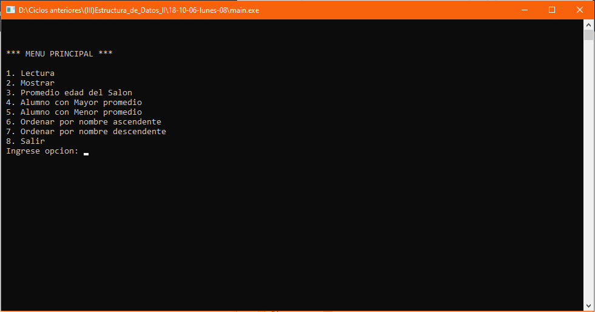

# Manejo de alumnos
Sistema de manejo de un conjunto de alumnos según sus atributos que permite ingresar alumnos, mostrar los alumnos ingresados, promediar sus edades, mostrar la nota y el nombre del alumno con mayor o menor promedio, ordenar ascendente o descendente según su nombre, **06/10/18**.

<strong>Imagen:</strong> Menú principal.

